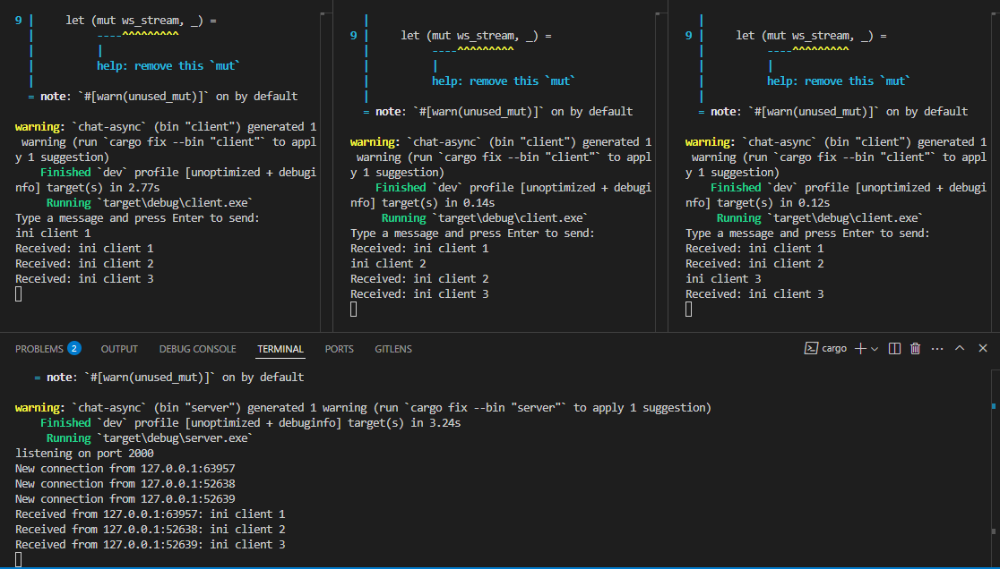
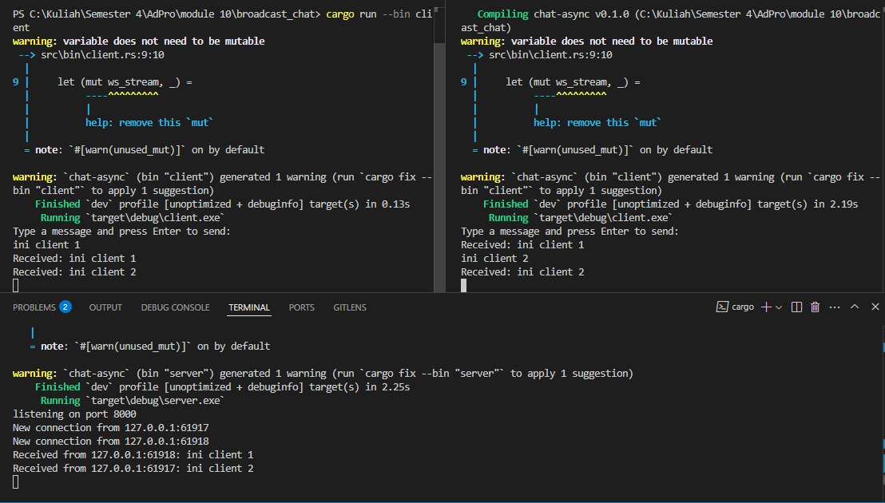
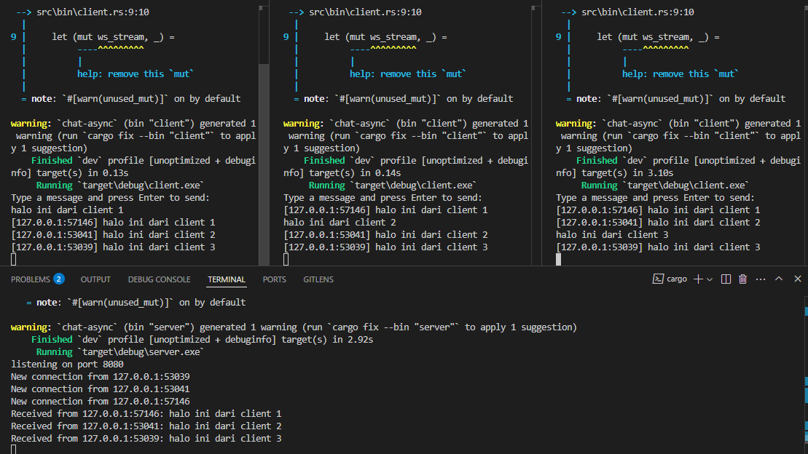
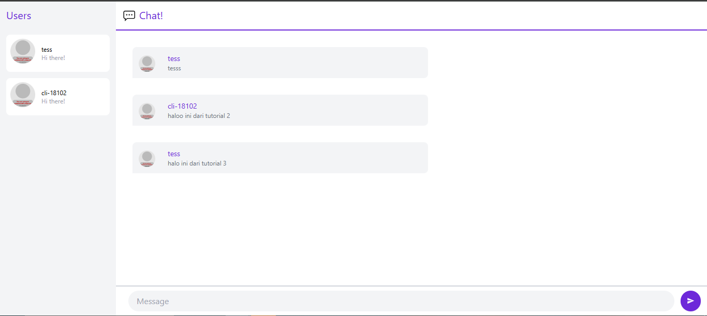
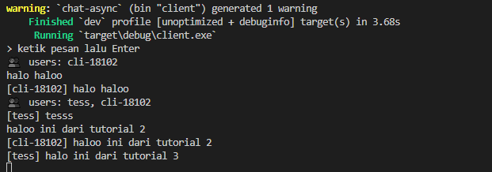

# Commit 1


Seperti yang ditunjukkan pada gambar, saya telah menjalankan satu instance server dan tiga instance client secara bersamaan untuk mendemonstrasikan fungsionalitas aplikasi chat. Server berhasil menerima koneksi dari ketiga client dan menampilkan alamat IP serta port dari setiap koneksi yang masuk. Ketika pesan dikirim dari salah satu client, server akan menerimanya dan langsung menyebarkannya ke semua client yang terhubung, memungkinkan komunikasi real-time antar pengguna.

Log server menampilkan informasi detail tentang aktivitas koneksi, termasuk waktu koneksi dibuat dan pesan-pesan yang diterima dari setiap client. Setiap client dapat melihat pesan yang dikirim oleh client lain berkat mekanisme broadcasting yang diimplementasikan menggunakan channel Tokio. Pendekatan asinkron memungkinkan server untuk menangani banyak koneksi secara efisien tanpa memblokir thread utama, sehingga aplikasi tetap responsif bahkan ketika jumlah client bertambah.

# Commit 2: Modifying Port


Untuk mengubah port aplikasi dari 2000 menjadi 8080, saya perlu memodifikasi dua file dalam kode:

1. Di file `server.rs`, saya mengubah alamat binding server dari "127.0.0.1:2000" menjadi "127.0.0.1:8080" pada baris yang mendefinisikan TcpListener. Ini mengubah port yang didengarkan oleh server.

2. Di file `client.rs`, saya mengubah URI koneksi dari "ws://127.0.0.1:2000" menjadi "ws://127.0.0.1:8080" pada kode yang membuat koneksi client. Perhatikan bahwa koneksi menggunakan protokol WebSocket yang ditandai dengan awalan "ws://" pada URI.

Setelah modifikasi, aplikasi masih berjalan dengan baik. Server sekarang mendengarkan pada port 8080 dan client terhubung ke port yang sama. Komunikasi antara client dan server tetap berfungsi seperti sebelumnya, memungkinkan pesan dikirim dan diterima antara semua client yang terhubung.

# Commit 3: Small Changes, Add IP and Port

Untuk meningkatkan fungsionalitas aplikasi chat, saya melakukan modifikasi pada kode sehingga pesan yang dikirim akan disertai dengan informasi pengirim (alamat IP dan port):

1. Di file `server.rs`, saya menambahkan informasi alamat pengirim pada pesan sebelum disebarkan:
   ```rust
   // Add sender information to message
   let formatted_msg = format!("[{}] {}", addr, text);
   
   // Broadcast to all subscribers
   let _ = bcast_tx.send(formatted_msg);
   ```

2. Di file `client.rs` tidak diperlukan perubahan khusus karena pesan yang diterima sudah diformat dengan informasi pengirim oleh server.

Dengan modifikasi ini, setiap kali pesan dikirim, penerima dapat melihat siapa (alamat IP dan port) yang mengirim pesan tersebut. Hal ini memudahkan pengguna untuk mengidentifikasi sumber pesan dalam percakapan grup, terutama ketika ada banyak klien yang terhubung secara bersamaan. Pendekatan ini menambahkan konteks pada percakapan tanpa perlu mengimplementasikan sistem login atau nama pengguna. Selain itu, solusi ini juga sangat efisien dari segi sumber daya karena hanya memerlukan sedikit tambahan pemrosesan pada server tanpa menambah beban pada klien. Implementasi ini juga dapat dengan mudah diperluas di masa depan, misalnya dengan menambahkan fitur nickname atau avatar untuk identifikasi pengguna yang lebih personal.

# Bonus 





Agar Rust server bisa dipakai oleh web-chat, ia **harus**:

1. Mengerti & mem‐parse JSON di atas.  
2. Tetap menerima plain-text (supaya CLI Tutorial 2 masih hidup).  
3. Menyediakan tiga _message type_ yang sama: `register`, `users`, `message`.

---

## 2 · Perubahan Kode di Rust Server

| Area | Cuplikan (pseudo) | Penjelasan |
|------|-------------------|-----------|
| **Struct baru** | ```rust<br>#[derive(Serialize,Deserialize)]<br>#[serde(rename_all="camelCase")]<br>struct ChatMessage {<br>  #[serde(rename="messageType")]<br>  message_type: MsgType,<br>  #[serde(skip_serializing_if="Option::is_none")]<br>  data: Option<String>,<br>  #[serde(rename="dataArray")]<br>  #[serde(skip_serializing_if="Option::is_none")]<br>  data_array: Option<Vec<String>>,<br>}<br>``` | Merepresentasikan format Tutorial 3, lengkap dengan `skip_serializing_if` agar field kosong tidak terkirim (`null` menyebabkan parsing error di Yew). |
| **Enum MsgType** | `enum MsgType { Users, Register, Message }` | Lebih aman dibanding string bebas. |
| **On receive()** | ```rust<br>if let Ok(cm)=serde_json::from_str::<ChatMessage>(&text){<br>  match cm.message_type {<br>    MsgType::Register => …,<br>    MsgType::Message  => …,<br>    _ => {}<br>  }<br>} else {   // fallback plain-text<br>   …<br>}<br>``` | 1. Coba parse JSON.  <br>2. Jika gagal → perlakukan sebagai text lama (kompatibel). |
| **Register** | *Setelah* sukses ‘register’, masukkan ke `HashMap` + broadcast `users`. | Mencegah alamat IP muncul di UI sebelum user pilih nickname. |
| **Broadcast users** | Fungsi `broadcast_users(&map, &tx)` membentuk `ChatMessage{messageType:"users", dataArray:[…]}`. |
| **Broadcast chat** | Bungkus `UserMessage {from, message, time}` menjadi string JSON, kemudian masukkan ke `ChatMessage{messageType:"message", data: SOME(json)}`. |
| **Ping watchdog** | Kirim `Ping` tiap 5 s.  Saat error → buang user & broadcast ulang daftar. |

---

## 3 · Mengapa Perubahan Ini Berhasil?

* **Format identik** – UI Yew hanya membaca tiga varian `messageType`; server kini mengirim _persis_ yang diharapkan.
* **Backward-compatible** – CLI lama masih berfungsi karena:
  * Register otomatis pakai alamat jika tidak ada `register`.
  * Plain-text tetap dibungkus & diteruskan ke semua klien.
* **Stateless di klien** – seluruh state (users & messages) dipush dari server; klien tidak perlu _polling_.

Bukti keberhasilan terlihat di dua screenshot di atas:  
1) CLI (Rust) & Browser saling bertukar pesan.  
2) Daftar pengguna (`tess`, `cli-18102`) sinkron di panel kiri Yew.

---
## 4. JS vs Rust

> Secara pribadi saya lebih memilih implementasi **Rust** untuk digunakan di produksi karena beberapa alasan kunci. Pertama, Rust dikompilasi menjadi satu berkas biner statis sehingga proses _deployment_ jauh lebih sederhana—cukup salin satu file berukuran belasan megabita tanpa dependensi Node. Kedua, model _async_ pada Tokio memanfaatkan memori secara efisien; dalam pengujian singkat server Rust mampu menangani ribuan koneksi dengan konsumsi RAM di bawah 10 MB, sedangkan versi Node membutuhkan puluhan hingga ratusan megabita. Ketiga, kekuatan sistem tipe Rust memberi jaminan keamanan & eliminasi kelas bug runtime (mis. `undefined` atau _race condition_ yang sering muncul di JavaScript).  

> Meski demikian, JavaScript memiliki keunggulan dalam tahap prototipe: ekosistem _npm_, _hot-reload_, dan kemudahan debugging di browser membuat iterasi UI sangat cepat. Bagi tim yang sudah mahir JavaScript dan membutuhkan waktu _go-to-market_ singkat, server Node bisa lebih praktis. Jadi pilihan akhirnya bergantung pada prioritas proyek: **kecepatan pengembangan** (Node) atau **efisiensi dan keandalan jangka panjang** (Rust).
